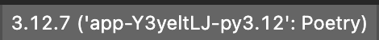

# S1 Analysis
The goal of this project is to extract insights from S-1 filings and other sources of data to better inform trades on newly public companies.


## Instructions
1. Install poetry: https://python-poetry.org/docs/
2. Install dependencies: `poetry install`
3. Start up the Poetry shell: `poetry shell`
4. Run the script: `python main.py`. You should see output like:
```
TitleElement: S-1
TextElement: 1
TextElement: forms-1.htm
TitleElement: As
filed with the Securities an...Commission on December 31, 2024
TextElement: Registration
Statement No. 333-...d: Rule-Page  Field: /Rule-Page
TitleElement: UNITED
STATES
TitleElement: SECURITIES
AND EXCHANGE COMMISSION
TitleElement: WASHINGTON,
```

Note: in VSCode ensure that you select interpreter by the following:
1. Open Your Project in VS Code: Navigate to your project directory and open it in VS Code.
2. Open the Command Palette: You can do this by pressing Ctrl + Shift + P (or Cmd + Shift + P on macOS).
3. Select Python Interpreter: Type "Python: Select Interpreter" in the Command Palette and select it from the list.
4. Select the interpreter that you installed via Poetry.



